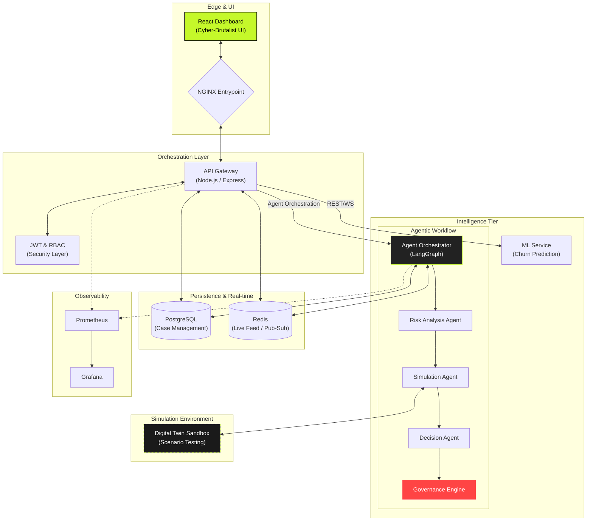

# 🚀 Sentient Retention Engine

> **The Intelligent SaaS Churn Defense System.**

A production-grade Agentic AI platform designed to predict, simulate, and prevent SaaS customer churn. Combining state-of-the-art Machine Learning with autonomous decision-making agents and Digital Twin simulations.

---

## 🏗️ System Architecture

The Sentient Retention Engine is built on a modular, secure, and observable microservices architecture designed for high-fidelity decisioning.



- **Frontend (Cyber-Brutalist)**: A high-performance React dashboard featuring real-time "Agent Activity Streams" and "Decision Timelines" for full observability.
- **API Gateway**: Secure entry point managing JWT authentication, role-based access control (RBAC), and service coordination.
- **Agentic AI Orchestrator**: A multi-agent system built on LangGraph that executes autonomous retention workflows (Observe -> Think -> Simulate -> Decide).
- **Digital Twin Sandbox**: A high-fidelity simulation environment where `SimulationAgent` tests intervention strategies against historical patterns before execution.
- **Predictive ML Service**: Real-time churn risk scoring using specialized usage-pattern analysis.
- **Observability Stack**: Integrated Prometheus and Grafana for real-time monitoring of agent confidence, execution times, and ROI metrics.

## ✨ Key Features

### 1. Adaptive Risk Prediction

Real-time churn probability scoring (LOW/MEDIUM/HIGH) based on usage metrics, support ticket volume, and payment behavior.

### 2. Autonomous Agentic Loop

The system executes a closed-loop decision process:

- **OBSERVE**: Intake customer telemetry.
- **THINK**: Interpret risk context and historical outcomes.
- **SIMULATE**: Run strategies through the Digital Twin.
- **DECIDE**: Select the optimal intervention (e.g., Discount, Proactive Outreach).

### 3. Digital Twin Validation

Every retention action is simulated in a sandbox to estimate churn reduction percentage before a single dollar is spent on discounts.

### 4. Enterprise-Grade Security

- **RBAC**: Multi-role system (Admin, Specialist) enforcing least-privilege access.
- **IDOR Protection**: Identity-validated data access for all sensitive endpoints.
- **Zero-Trust Config**: No hardcoded secrets; strictly environment-variable driven.

---

## 🚦 Quick Start

### Prerequisites

- Node.js 20+
- Python 3.10+
- Docker & Docker Compose
- PostgreSQL 15+

### 1. One-Command Setup (Docker)

```bash
docker-compose up --build
```

### 2. Manual Setup

Refer to the detailed [Setup Guide](./docs/SETUP.md) for local development configurations.

## 🛠️ Technology Stack

| Layer | Technologies |
| :--- | :--- |
| **Frontend** | React 18, Tailwind CSS, Recharts, Framer Motion |
| **Backend** | Node.js, Express, JWT, Redis |
| **AI/ML** | FastAPI, scikit-learn, LangGraph, Groq/OpenAI |
| **Infrastructure** | Docker, Nginx, PostgreSQL, GitHub Actions |

---

## 📖 Documentation

Explore the comprehensive documentation for each domain:

- 🏗️ **[Architecture](./docs/ARCHITECTURE.md)**: Deep dive into service interactions.
- 🛡️ **[Security](./docs/SECURITY.md)**: RBAC, IDOR remediation, and hardening.
- 📡 **[API Reference](./docs/API.md)**: Full endpoint documentation.
- 🧪 **[Development](./docs/DEVELOPMENT.md)**: Testing and contribution guidelines.

---

## 📜 License

Distributed under the MIT License. See `LICENSE` for more information.

---
Built with ❤️ by Satyam Raghuvanshi and Warth-Of-CodeGod.
