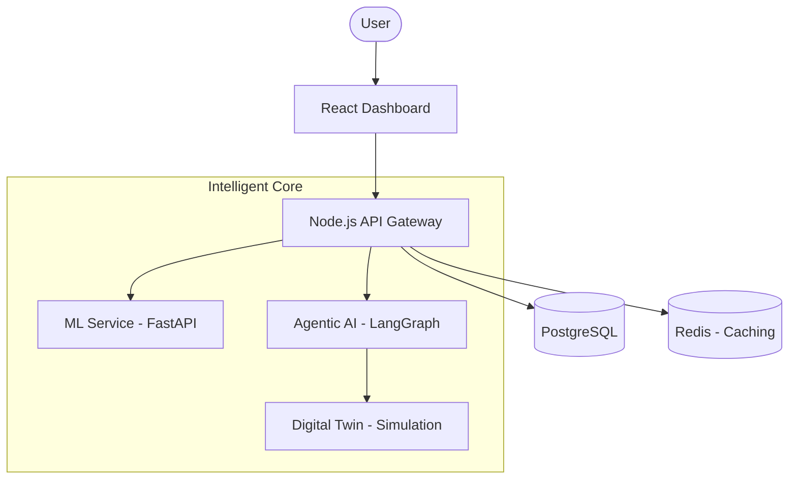

# 🚀 Sentient Retention Engine

> **The Intelligent SaaS Churn Defense System.**

A production-grade Agentic AI platform designed to predict, simulate, and prevent SaaS customer churn. Combining state-of-the-art Machine Learning with autonomous decision-making agents and Digital Twin simulations.

---

## 🏗️ System Architecture

The engine is built as a highly modular, secure microservices architecture:



- **Frontend**: Real-time analytics dashboard with deep-dive risk inspection.
- **Backend**: Secure API gateway with Role-Based Access Control (RBAC).
- **ML Service**: Predictive engine analyzing usage patterns and risk indicators.
- **Agentic AI**: Multi-agent system that observes, thinks, and decides on retention strategies.
- **Digital Twin**: High-fidelity simulation environment to validate actions before deployment.

---

## ✨ Key Features

### 1. Adaptive Risk Prediction

Real-time churn probability scoring (LOW/MEDIUM/HIGH) based on usage metrics, support ticket volume, and payment behavior.

### 2. Autonomous Agentic Loop

The system executes a closed-loop decision process:

- **OBSERVE**: Intake customer telemetry.
- **THINK**: Interpret risk context and historical outcomes.
- **SIMULATE**: Run strategies through the Digital Twin.
- **DECIDE**: Select the optimal intervention (e.g., Discount, Proactive Outreach).

### 3. Digital Twin Validation

Every retention action is simulated in a sandbox to estimate churn reduction percentage before a single dollar is spent on discounts.

### 4. Enterprise-Grade Security

- **RBAC**: Multi-role system (Admin, Specialist) enforcing least-privilege access.
- **IDOR Protection**: Identity-validated data access for all sensitive endpoints.
- **Zero-Trust Config**: No hardcoded secrets; strictly environment-variable driven.

---

## 🚦 Quick Start

### Prerequisites

- Node.js 20+
- Python 3.10+
- Docker & Docker Compose
- PostgreSQL 15+

### 1. One-Command Setup (Docker)

```bash
docker-compose up --build
```

### 2. Manual Setup

Refer to the detailed [Setup Guide](./docs/SETUP.md) for local development configurations.

---

## 🛠️ Technology Stack

| Layer | Technologies |
| :--- | :--- |
| **Frontend** | React 18, Tailwind CSS, Recharts, Framer Motion |
| **Backend** | Node.js, Express, JWT, Redis |
| **AI/ML** | FastAPI, scikit-learn, LangGraph, Groq/OpenAI |
| **Infrastructure** | Docker, Nginx, PostgreSQL, GitHub Actions |

---

## 📖 Documentation

Explore the comprehensive documentation for each domain:

- 🏗️ **[Architecture](./docs/ARCHITECTURE.md)**: Deep dive into service interactions.
- 🛡️ **[Security](./docs/SECURITY.md)**: RBAC, IDOR remediation, and hardening.
- 📡 **[API Reference](./docs/API.md)**: Full endpoint documentation.
- 🧪 **[Development](./docs/DEVELOPMENT.md)**: Testing and contribution guidelines.

---

## 📜 License

Distributed under the MIT License. See `LICENSE` for more information.

---
Built with ❤️ by Satyam Raghuvanshi and RunTime_Terror.
